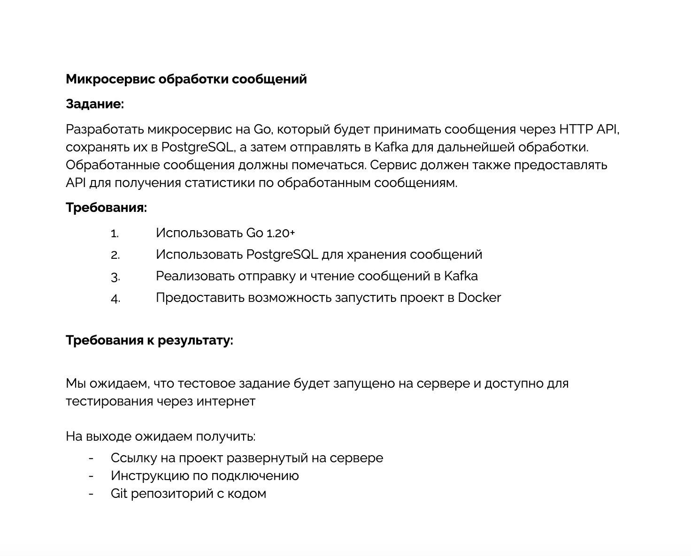

# Messagio

## Test Challenge



Swagger - [http://62.109.20.78:8081/docs/index.html](http://62.109.20.78:8081/docs/index.html)

Get Access Token

```sh
curl --location 'http://62.109.20.78:8081/auth' \
--header 'Content-Type: application/json' \
--data-raw '{
    "username": "user@user.com",
    "password": "password"
}'
```

Send Single Message

```sh
curl --location 'http://62.109.20.78:8081/api/single' \
--header 'Content-Type: application/json' \
--header 'Authorization: Bearer XXX' \
--data-raw '{
    "text": "some text",
    "to": "email@example.com"
}'
```

Send Multiple Messages

```sh
curl --location 'http://62.109.20.78:8081/api/batch' \
--header 'Content-Type: application/json' \
--header 'Authorization: Bearer XXX' \
--data-raw '[
    {
        "text": "some text",
        "to": "email@example"
    },
    {
        "text": "some text 2",
        "to": "email2@example.com"
    }
]'
```

Message Details

```sh
curl --location 'http://62.109.20.78:8081/api/details/_LC-vkQ1QJimXBW5AL1xw' \
--header 'Authorization: Bearer XXX'
```

### Docker (arch linux/amd64)

First of all, create `.env` file with following content:

```sh
# zookeeper
ZOOKEEPER_CLIENT_PORT=2181
ZOOKEEPER_TICK_TIME=2000

# kafka
KAFKA_SERVER=messagio-kafka-1:29092
KAFKA_BROKER_ID=1
KAFKA_ZOOKEEPER_CONNECT=zookeeper:2181
KAFKA_ADVERTISED_LISTENERS=PLAINTEXT://kafka:9092,PLAINTEXT_HOST://localhost:29092
KAFKA_LISTENER_SECURITY_PROTOCOL_MAP=PLAINTEXT:PLAINTEXT,PLAINTEXT_HOST:PLAINTEXT
KAFKA_INTER_BROKER_LISTENER_NAME=PLAINTEXT
# less than or equal to the number of brokers, in the example there is one broker
KAFKA_OFFSETS_TOPIC_REPLICATION_FACTOR=1

# postgres
POSTGRES_DB=messagio
POSTGRES_USER=messagio
POSTGRES_PASSWORD=messagio
POSTGRES_HOST=messagio-postgres-1
POSTGRES_PORT=5432

# app
TOPIC_PREFIX=new_messages
TOPIC_SEGMENTS=3
TOPIC_SEGMENT_PARTITION=3
TOKEN_SECRET=supersecret
```

and then

```sh
make up
```

```sh
make run
```
